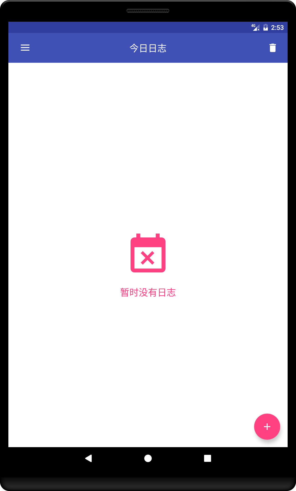

# Coder's Life(程序员日志)

## 概述

本App的目标是为广大程序员们提供一个管理自己的软件，所以起名叫程序员日志。
使用者可以添加今日完成（或者打算完成）的需求、debug以及发布（或者打算发布）的版本。

## 功能

- [X] 添加（显示）今日日志

- [x] 显示所有日志

- [ ] 未完成的日志

- [x] 所有日志分页加载

- [x] 侧滑删除

- [ ] 统计页

- [x] 草稿箱

- [x] 图标

## 项目详细

本项目借助DataBinding实现了MVVM框架，使用SQLite作为本地数据库。

## 截图

## APK

[APK点此下载](./apk/coderlife_release_1.0.apk)

## 重构进度

真正的 MVVM + 模块化 + Kotlin 重构
